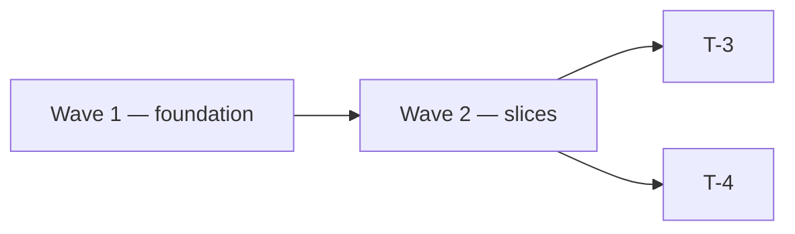

# Plan — <feature name>

## Wave 1 — <name> (serial)
### T-1 — <title>
domain_tags: [backend, nodejs]              # → drives skill manifest
skills: [nodejs-specialist, tdd, observability, test-doubles-strategy]
acceptance:
  - <testable statement>
evaluation:
  - Unit: <what>
  - Integration: <what, with which tool>
  - E2E: <what or "N/A — no user-facing surface">

## Wave 2 — <name>
Serial by default. Parallel subsets:
  parallel: [T-3, T-4]                      # disjoint files, no ordering dep

### T-3 — ...
### T-4 — ...

## Wave Graph
<!-- optional but preferred for 2+ waves — renders as SVG in the design-review surface -->

## Risk Mitigations
- Risk: <from spec.md> → addressed by: T-N
