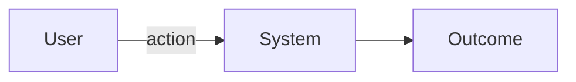

# Spec — <feature name>

## Tech Stack
| Area | Chosen | Alternatives | Why (tradeoff) |
|------|--------|--------------|----------------|
|      |        |              |                |

## Test Infrastructure
| Dep | Tool | Why (tradeoff) | Source consulted |
|-----|------|----------------|------------------|
|     |      |                |                  |

## Requirements
FR-1: <one sentence, testable>
FR-2: ...

## Flows
<!-- optional but strongly preferred for anything with >1 step or actor —
     mermaid renders as an SVG diagram in the design-review surface -->

## Technical Risks
- <risk + mitigation>

## Performance Budgets
- <only if relevant: page load, API p99, etc.>

## Non-Goals
- <what we are explicitly NOT doing>
